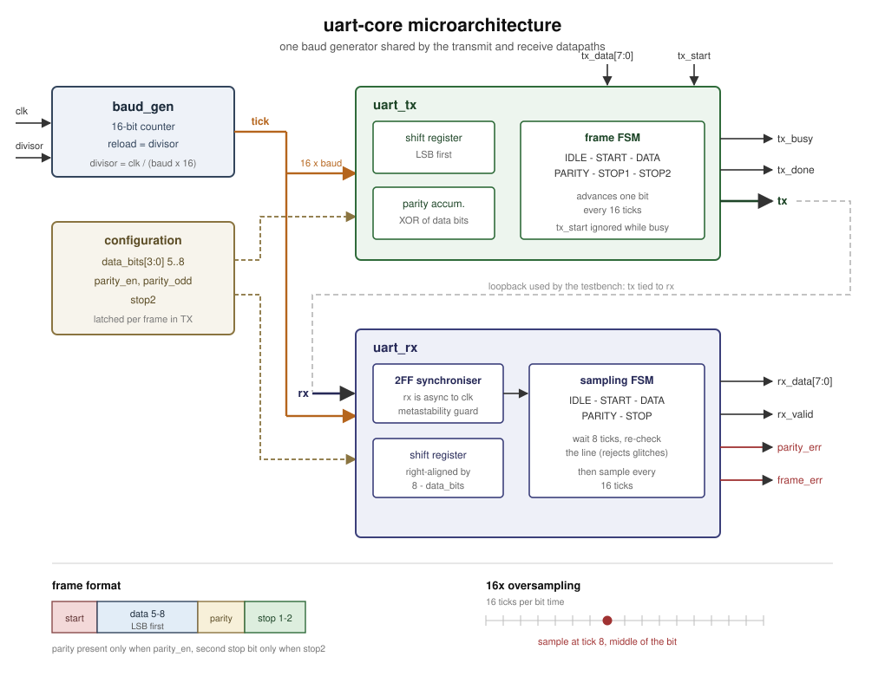

# uart-core

A configurable UART transmitter and receiver in Verilog, with a
self-checking [cocotb](https://www.cocotb.org/) testbench that uses
randomized stimulus and a functional coverage model.




## Features

- **Configurable at runtime**, no resynthesis needed: baud divisor,
  5–8 data bits, no/even/odd parity, 1 or 2 stop bits.
- **16x oversampling.** The receiver waits half a bit time after the
  start edge, re-checks the line, and from then on samples in the
  middle of every bit, which is what gives tolerance to baud mismatch
  between the two ends.
- **Glitch rejection.** If the line has gone high again at the mid-start
  check, the edge was noise and the receiver returns to idle instead of
  decoding a bogus frame.
- **Clock domain crossing handled.** The `rx` pin is asynchronous to
  `clk`, so it goes through a two-flop synchroniser before any logic
  looks at it.
- **Error detection.** `parity_err` and `frame_err` (stop bit not high)
  are reported alongside `rx_valid`, and the payload is still delivered
  so the caller can decide what to do with it.
- **Config is latched per frame** in the transmitter, so reprogramming
  the format mid-frame cannot corrupt the frame already in flight.

## Interface

| Signal | Dir | Description |
|---|---|---|
| `divisor[15:0]` | in | `clk / (baud × 16)`, e.g. 27 for 115200 baud at 50 MHz |
| `data_bits[3:0]` | in | payload width, 5 to 8 |
| `parity_en`, `parity_odd` | in | parity off/on, even/odd |
| `stop2` | in | 0 = one stop bit, 1 = two |
| `tx_data[7:0]`, `tx_start` | in | byte to send; pulse `tx_start` for one clock |
| `tx_busy`, `tx_done`, `tx` | out | busy for the whole frame; `tx_done` pulses at the end |
| `rx` | in | asynchronous serial input |
| `rx_data[7:0]`, `rx_valid` | out | received byte, valid for one clock |
| `parity_err`, `frame_err`, `rx_busy` | out | error flags, valid with `rx_valid` |

`tx_start` is ignored while `tx_busy` is high, so a sender only needs to
wait for `tx_done` before starting the next byte.

## Running the tests

```bash
sudo apt install iverilog gtkwave
pip install cocotb

cd tb
make
```

All 7 test groups pass on Icarus Verilog 12.0 with cocotb 2.1:

```
test_loopback_directed            PASS    known bytes through tx -> rx
test_all_configs_randomized       PASS    randomized payloads, every config
test_parity_error_detected        PASS    corrupted parity bit is flagged
test_framing_error_detected       PASS    stop bit held low is flagged
test_back_to_back_transfers       PASS    no idle gap between frames
test_start_bit_glitch_rejected    PASS    narrow low pulse is not a frame
test_tx_busy_protocol             PASS    mid-frame tx_start is ignored
```

The randomized test sweeps all 24 legal configurations (5–8 data bits ×
none/even/odd parity × 1/2 stop bits) with 5 payloads each, and prints a
functional coverage report at the end — **16/16 bins, 100%**, across 120
frames.

Error injection doesn't rely on the transmitter. A small software UART
in the testbench bit-bangs frames directly onto the `rx` pin, so the
receiver is checked against an independent model and can be fed
deliberately malformed frames.

The RTL is also clean under `verilator --lint-only -Wall`.

Every run writes `tb/waves.vcd` — open it with `gtkwave tb/waves.vcd`.

## Notes / possible extensions

- No FIFOs: the interface is one byte at a time. TX and RX FIFOs would
  be the natural next step for use in a real SoC.
- No bus interface yet. Wrapping the config and data registers behind
  AXI-Lite or APB would make this a drop-in peripheral.
- Oversampling uses a single mid-bit sample. Majority voting over
  samples 7, 8 and 9 would improve noise immunity.
